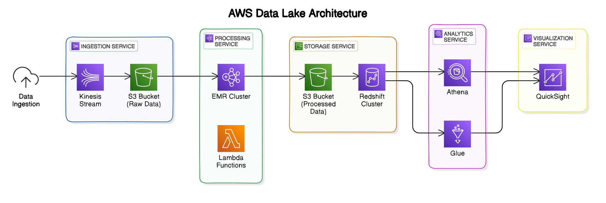

# Tags
- [Tag1](#tag1) 
- [Tag2](#tag2) 
## Tag1
Content related to Tag1.

## Tag2
Content related to Tag2.

# Heading 1
## Heading 2
### Heading 3
1. First item
2. Second item
3. Third item
- Item 1
- Item 2
- Item 3
```python
# Here's an example of inline code: print("Hello, World!")

def greet():
print("Hello, World!")
```
highlight 

| Column 1 | Column 2 | Column 3 |
| ----- | ----- | ----- |
| Data 1 | Data 2 | Data 3 |
| Data 4 | Data 5 | Data 6 |
>  This is a blockquote.
It can span multiple lines. 

- [x] Task 1
- [ ] Task 2
- [ ] Task 3
---

---

---

:rocket: This project is amazing! :fire:

>  [!NOTE]
 Description :+1: 

Let's rename *our-new-project* to *our-old-project*.


## Diagrams
---
</a>


  
<p align="center">
  
</p>

---

<p align="center">
  
  
</p>
 <p align="center">
